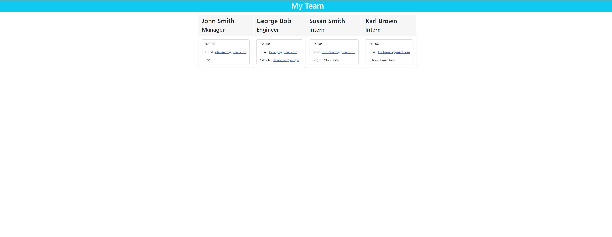

# Team-Profle-Generator

  ## Description

  Program prompts user for information on employees, and generates a team profile webpage, based on user submitted information.
  
  
  
  
  ## Table of Contents 
  
  
  - [Description](#description)
  - [Installation](#installation)
  - [Usage](#usage)
  - [License](#license)
  - [Contribution](#contribution)
  - [Testing](#testing)
  - [Questions](#questions)
  - [Credits](#credits)
  
  
  ## Installation
  Download files from github, open in console/node. Run NPM install to install depedencies. Run node index.js in console to run program.
  
  ## Usage
  Run node index.js in console, then input employee information

  ## License
  MIT License

  https://choosealicense.com/licenses/mit/

  ---
  
  

  ## Testing
  run npm test in console to run through test cases

  ## Questions
  Github Profile: www.github.com/jcgasper
  Email: jacobgasper@gmail.com

 
  ## Additional Info
  Created using Javascript/HTML/NPM/NODE

  ## Credits:

  Jacob Gasper

  [Github Repo](https://github.com/jcgasper/Team-Profle-Generator "Github Repo")
  

  [Video Walkthrough](https://drive.google.com/file/d/169ip_SvAb5aPcX4rR0yPr8lGzGDGO0X-/view "Video walkthrough");